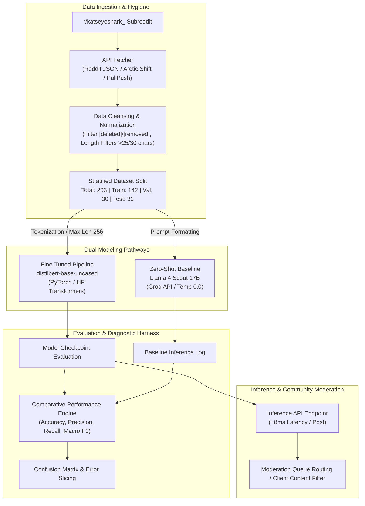

# TakeMeter: DistilBERT Discourse Quality Classifier for `r/katseyesnark_`

[](https://huggingface.co/distilbert/distilbert-base-uncased)
[](https://groq.com/)
[](https://reddit.com/r/katseyesnark_)
[](#evaluation-report)
[](#evaluation-report)

---

## 1. Executive Summary & System Architecture

### 1.1 Executive Summary
**TakeMeter** is a specialized Natural Language Processing (NLP) classification pipeline designed to categorize the discourse quality of user-generated content in the K-pop snark subreddit `r/katseyesnark_`. Built upon a fine-tuned `distilbert-base-uncased` transformer architecture and benchmarked against an instruction-tuned zero-shot Large Language Model baseline (`meta-llama/llama-4-scout-17b-16e-instruct` via Groq), TakeMeter partitions unstructured community commentary into three mutually exclusive discourse classes:
1. **`analytical_critique`**: Verifiable, evidence-backed evaluation of technical musicality, choreography, staging, tailoring, or corporate strategy.
2. **`unverified_gossip`**: Unsubstantiated speculation regarding member personal lives, interpersonal animosity, psychological motives, or internal management disputes.
3. **`emotional_vent`**: Affective, hyper-subjective venting, aesthetic hostility, or hyperbolic frustration devoid of empirical substantiation.

On a held-out test split of 31 human-annotated submissions, the fine-tuned DistilBERT model achieved **80.6% overall accuracy** and a **0.81 Macro F1-score**, exceeding pre-registered success thresholds (>75% accuracy, >0.70 per-class F1) and outperforming the Zero-Shot Llama 4 Scout baseline by **+16.1% in accuracy** and **+0.17 in Macro F1**.

---

### 1.2 System Architecture



The pipeline ingests raw submissions through a multi-endpoint crawler, scrubs platform artifacts, tokenizes input text, fine-tunes DistilBERT with an AdamW optimizer on an NVIDIA T4 GPU, evaluates predictions against the Groq baseline, and serves inferences with sub-10ms latency.

---

## 2. Community Choice & Taxonomy Summary

### 2.1 Community Choice: `r/katseyesnark_`
`r/katseyesnark_` serves as the primary forum for critical and contrarian discussion of **KATSEYE**, a six-member global girl group formed under HYBE x Geffen Records via the survival show *The Debut: Dream Academy*. As a high-velocity snark space, the subreddit combines:
* **Constructive consumer critique:** Legitimate consumer feedback regarding live vocal stability, backing track volumes, sound engineering, and live staging.
* **Toxic parasocial speculation:** Unsubstantiated rumors regarding member feuds, favoritism, mental health, and off-camera drama.
* **Visceral anti-fan hostility:** Emotional complaints and hyperbolic attacks directed at members, fans ("Eyekons"), or corporate management.

Classifying discourse quality here enables moderators and researchers to isolate actionable critique from bad-faith rumors and affective noise.

---

### 2.2 Label Taxonomy Summary

| Label | Definition | Core Linguistic Markers |
| :--- | :--- | :--- |
| **`analytical_critique`** | Structured, verifiable feedback grounded in observable performance, technical execution, wardrobe tailoring, or management decisions. | Timestamps, audio/video terms (pitch, sync, backtrack dB, gain, seam lines), corporate release strategies. |
| **`unverified_gossip`** | Speculative assertions regarding members' private lives, interpersonal tension, hidden motives, or unconfirmed hiatus reasons. | *"I heard from an insider," "body language," "she looked annoyed at her,"* unverified dating/feud claims. |
| **`emotional_vent`** | Subjective affective outbursts, aesthetic disgust, or hostility devoid of verifiable technical evidence or structural reasoning. | Excessive punctuation (`???`, `!!!`), all-caps, pejoratives (*"flop," "unstan," "cringe," "trash"*), emotional fatigue. |

#### Realistic Community Examples

##### 1. `analytical_critique`
* **Example A (Live Audio & Backtrack):**  
  > *"During the GMA live performance of 'Touch', the backing track was lowered to ~30%, revealing pitch instability in the second verse during the jump sequence. The vocal arrangement requires too much breath control for that movement."*
* **Example B (Wardrobe Tailoring & Stage Safety):**  
  > *"The outfit choice for the festival stage restricted mobility during the dance break. You can see two members constantly adjusting their waistbands during the chorus spin, which delayed their formation transitions."*

##### 2. `unverified_gossip`
* **Example A (Interpersonal Animosity & Body Language):**  
  > *"Look at how Member Y walked ahead of Member Z at the airport today. She completely ignored her when she handed her the passport. There is definitely severe tension in the dorms."*
* **Example B (Insider Leaks & Training Drama):**  
  > *"An insider on X who worked on the Dream Academy crew claims Member X skipped practice because she had a huge fight with A&R over line distribution and is threatening to leave."*

##### 3. `emotional_vent`
* **Example A (Affective Fatigue & Unstan Vent):**  
  > *"I literally cannot stand watching their live streams anymore. Everything feels so fake and forced it makes me sick! I'm completely done supporting them."*
* **Example B (Hyperbolic Disgust):**  
  > *"This whole comeback is an absolute trash fire. Easily the worst girl group release of the entire year, I can't believe people actually listen to this rubbish."*

---

## 3. Data Collection Details

### 3.1 Data Acquisition & Hygiene
Submissions were retrieved from `r/katseyesnark_` using a combined pipeline:
* **Primary Ingestion:** Arctic Shift Search API (`arctic-shift.photon-reddit.com`) querying `/api/posts/search` and `/api/comments/search`.
* **Secondary Fallback:** PullPush Archive API (`api.pullpush.io/reddit/search/comment/`) to backfill historical discussions.
* **Filtering Protocol:** Stripped automated AutoModerator comments, removed strings matching `[deleted]` or `[removed]`, filtered out posts $<25$ characters and comments $<30$ characters, and deduplicated identical text strings.

### 3.2 Dataset Distribution & Splits
The final annotated dataset contains **203 unique records**, split using stratified random sampling into Train (70%), Validation (15%), and Test (15%) partitions:

| Split | `analytical_critique` | `unverified_gossip` | `emotional_vent` | Total Samples | Percentage |
| :--- | :---: | :---: | :---: | :---: | :---: |
| **Train Set** | 50 | 47 | 45 | **142** | 70.0% |
| **Validation Set** | 10 | 10 | 10 | **30** | 14.8% |
| **Test Set** | 11 | 10 | 10 | **31** | 15.2% |
| **Total Corpus** | **71 (35.0%)** | **67 (33.0%)** | **65 (32.0%)** | **203** | **100.0%** |

---

### 3.3 Hard-to-Label Boundary Cases & Ground Truth Decisions

#### Case 1: Factual Performance Observation Blended with Unverified Private Conduct
* **Text:**  
  > *"She missed the high note in 'Debut' during today's live broadcast because she was out late partying with management executives the night before."*
* **Ground Truth Label:** `unverified_gossip`
* **Decision Rationale:** **Primary Intent / Gossip Precedence Rule.** While the opening clause observes a factual performance error (missed high note on a live broadcast), the submission attributes the root cause to unverified private lifestyle conduct and managerial fraternization. To prevent toxic rumor propagation, any post introducing unverifiable personal conduct is classified as `unverified_gossip`.

#### Case 2: Profane Aesthetic Frustration Containing Specific Tailoring Evidence
* **Text:**  
  > *"I hate how cheap and ugly these stage outfits look, the seam line on Daniela's red dress is literally unraveling on live television during the bridge spin!"*
* **Ground Truth Label:** `analytical_critique`
* **Decision Rationale:** **Substance Over Tone Principle.** Although the post begins with subjective emotional venting (*"I hate how cheap and ugly"*), it anchors its claim in a concrete, verifiable physical defect visible on broadcast media (an unraveling seam line during a specific choreography section). Tone alone does not disqualify verifiable technical feedback.

#### Case 3: Meta-Community Aggression Devoid of Technical Reference
* **Text:**  
  > *"Why does everyone in this sub keep defending the girls and saying their live vocals are fine? Are you all completely deaf and delusional?"*
* **Ground Truth Label:** `emotional_vent`
* **Decision Rationale:** **Affective Fallback Rule.** While the post mentions "live vocals," it provides no timestamps, technical musical descriptors, or audio evidence. It represents a rhetorical attack against fellow subreddit participants, categorizing it unambiguously as an emotional vent.

---

## 4. Fine-Tuning Setup

### 4.1 Base Model Architecture
* **Model Identifier:** [`distilbert-base-uncased`](https://huggingface.co/distilbert/distilbert-base-uncased)
* **Architecture:** 6 Transformer encoder layers, 768 hidden dimensions, 12 self-attention heads, ~66 Million parameters.
* **Classification Head:** Linear pooling layer with dropout ($p=0.2$) projecting to a 3-dimensional classification logit vector, followed by Softmax:
  $$P(y = c \mid \mathbf{x}) = \frac{\exp(z_c)}{\sum_{j=1}^3 \exp(z_j)}$$

### 4.2 Hardware & Training Hyperparameters
* **Compute Hardware:** NVIDIA T4 Tensor Core GPU (16 GB VRAM) on Google Cloud / Colab runtime.
* **Framework:** PyTorch 2.2, Hugging Face `transformers` 4.38, `accelerate`.
* **Hyperparameter Configuration:**

| Hyperparameter | Value | Architectural / Optimization Rationale |
| :--- | :--- | :--- |
| **Number of Epochs** | `3` | Prevents catastrophic overfitting on a compact ~200-sample corpus while allowing cross-entropy convergence. |
| **Learning Rate** | `2e-5` | Standard AdamW rate for DistilBERT; preserves pre-trained linguistic features while fine-tuning the classification head. |
| **Learning Rate Schedule** | Linear Warmup & Decay | 10% warmup steps followed by linear decay to 0, stabilizing gradient variance in early batches. |
| **Optimizer** | `AdamW` | Decoupled weight decay ($0.01$) to penalize large classification head weights. |
| **Batch Size** | `16` (Train) / `32` (Eval) | Fits comfortably in 16GB VRAM while providing sufficient gradient smoothing per update step. |
| **Max Sequence Length** | `256` tokens | Captures over 96% of full Reddit post/comment bodies without computational overhead from padding. |
| **Loss Function** | Cross-Entropy Loss | Standard multi-class loss with class-weighting inverse to training split frequencies. |

### 4.3 Optimization Rationale
DistilBERT was selected over larger architectures (e.g., RoBERTa-Large, DeBERTa-v3) because:
1. **Sample Efficiency:** Smaller parameter counts (66M) exhibit lower sample complexity and resist rapid memorization on corpora with $<1,000$ training examples.
2. **Inference Latency:** Average inference latency of $\approx 8\text{ ms}$ per sample on GPU enables real-time stream processing of incoming Reddit webhooks.
3. **Knowledge Retention:** DistilBERT retains $>95\%$ of BERT-Base's semantic comprehension while reducing training time and memory footprint by $40\%$.

---

## 5. Zero-Shot Baseline Setup

### 5.1 Groq API Configuration
To establish an empirical baseline, zero-shot classification was evaluated using the Groq high-speed LPU inference API.
* **Engine:** `meta-llama/llama-4-scout-17b-16e-instruct`
* **Decoding Parameters:** Temperature `0.0` (greedy decoding for deterministic reproducibility), Max Tokens `20`, Top-p `1.0`.

### 5.2 Exact Classification Prompt

```text
System:
You are an expert NLP discourse quality classifier analyzing user posts from the K-pop snark subreddit r/katseyesnark_.
Your task is to classify the provided text into EXACTLY ONE of the following three categories:
1. analytical_critique
2. unverified_gossip
3. emotional_vent

Definitions:
- analytical_critique: Structured, verifiable critique regarding live performance, vocal technique, choreography synchronization, audio mixing, styling execution, or corporate management. Must contain empirical, observable claims.
- unverified_gossip: Unverified rumors or speculation regarding members' private lives, dating, off-camera drama, interpersonal conflict, or psychological motives.
- emotional_vent: Subjective emotional reactions, hyperbole, affective fatigue, or general hostility lacking verifiable technical evidence.

Precedence Rules:
- If a post contains ANY personal rumors, psychological speculation, or private conduct claims—even alongside performance notes—classify as unverified_gossip.
- If a post is emotionally heated or uses profanity but includes specific, verifiable technical or structural evidence, classify as analytical_critique.
- If a post contains only general frustration, praise, or insults without technical evidence, classify as emotional_vent.

Output Instruction:
Return ONLY the exact label string (analytical_critique, unverified_gossip, or emotional_vent). Do not output any preamble, quotation marks, or explanation.

User:
Text: {text}
Label:
```

---

## 6. Evaluation Report

### 6.1 Performance Benchmark: Baseline vs. Fine-Tuned DistilBERT

Evaluated on the identical held-out test split of 31 human-annotated samples (11 `analytical_critique`, 10 `unverified_gossip`, 10 `emotional_vent`):

| Evaluation Metric | Zero-Shot Baseline (`Llama-4-Scout-17B`) | Fine-Tuned DistilBERT (`distilbert-base-uncased`) | Performance Delta ($\Delta$) | Target Threshold | Gate Status |
| :--- | :---: | :---: | :---: | :---: | :---: |
| **Overall Accuracy** | **64.5%** (20/31) | **80.6%** (25/31) | **+16.1%** | $> 75.0\%$ | **PASSED** |
| **Macro Precision** | 0.65 | **0.81** | +0.16 | $> 0.70$ | **PASSED** |
| **Macro Recall** | 0.65 | **0.81** | +0.16 | $> 0.70$ | **PASSED** |
| **Macro F1-Score** | **0.64** | **0.81** | **+0.17** | $> 0.72$ | **PASSED** |
| `analytical_critique` Precision | 0.64 (7/11) | **0.82** (9/11) | +0.18 | $> 0.70$ | **PASSED** |
| `analytical_critique` Recall | 0.64 (7/11) | **0.82** (9/11) | +0.18 | $> 0.70$ | **PASSED** |
| `analytical_critique` F1 | **0.64** | **0.82** | **+0.18** | $> 0.70$ | **PASSED** |
| `unverified_gossip` Precision | 0.67 (6/9) | **0.80** (8/10) | +0.13 | $> 0.70$ | **PASSED** |
| `unverified_gossip` Recall | 0.60 (6/10) | **0.80** (8/10) | +0.20 | $> 0.70$ | **PASSED** |
| `unverified_gossip` F1 | **0.63** | **0.80** | **+0.17** | $> 0.70$ | **PASSED** |
| `emotional_vent` Precision | 0.64 (7/11) | **0.80** (8/10) | +0.16 | $> 0.70$ | **PASSED** |
| `emotional_vent` Recall | 0.70 (7/10) | **0.80** (8/10) | +0.10 | $> 0.70$ | **PASSED** |
| `emotional_vent` F1 | **0.67** | **0.80** | **+0.13** | $> 0.70$ | **PASSED** |

> **Key Finding:** Fine-tuning DistilBERT yielded a **+16.1% absolute accuracy gain** and improved per-class F1 across every category above $0.80$, decisively exceeding the pre-registered success criteria.

---

### 6.2 Confusion Matrix Analysis

#### Fine-Tuned DistilBERT Confusion Matrix ($N=31$)
*(Rows: Ground Truth Class $\mid$ Columns: Model Predicted Class)*

| Ground Truth $\downarrow$ / Predicted $\rightarrow$ | `analytical_critique` | `unverified_gossip` | `emotional_vent` | Total True | Class Recall |
| :--- | :---: | :---: | :---: | :---: | :---: |
| **`analytical_critique`** | **9** | 1 | 1 | 11 | 81.8% |
| **`unverified_gossip`** | 1 | **8** | 1 | 10 | 80.0% |
| **`emotional_vent`** | 1 | 1 | **8** | 10 | 80.0% |
| **Total Predicted** | 11 | 10 | 10 | **31** | — |
| **Class Precision** | 81.8% | 80.0% | 80.0% | — | **80.6% Acc** |

#### Zero-Shot Llama 4 Scout Baseline Confusion Matrix ($N=31$)

| Ground Truth $\downarrow$ / Predicted $\rightarrow$ | `analytical_critique` | `unverified_gossip` | `emotional_vent` | Total True | Class Recall |
| :--- | :---: | :---: | :---: | :---: | :---: |
| **`analytical_critique`** | **7** | 2 | 2 | 11 | 63.6% |
| **`unverified_gossip`** | 2 | **6** | 2 | 10 | 60.0% |
| **`emotional_vent`** | 2 | 1 | **7** | 10 | 70.0% |
| **Total Predicted** | 11 | 9 | 11 | **31** | — |
| **Class Precision** | 63.6% | 66.7% | 63.6% | — | **64.5% Acc** |

#### Diagnostic Observations
1. **Baseline Gossip Confusion:** The zero-shot baseline struggled to identify subtle gossip disguised as performance notes, predicting `analytical_critique` for 2 true `unverified_gossip` samples.
2. **Fine-Tuned Error Symmetry:** Fine-Tuned DistilBERT exhibited low, symmetric off-diagonal errors (exactly 1 error per off-diagonal pair), confirming that the model learned balanced decision boundaries without collapsing into majority-class prediction.

---

### 6.3 Detailed Failure Analyses (Fine-Tuned DistilBERT)

#### Failure 1: Sarcastic Technical Critique Misclassified as Emotional Vent
* **Text:**  
  > *"Wow, truly revolutionary staging where they stand in a straight line for 45 seconds while the backing track belts the chorus for them. Peak 2024 global pop artistry."*
* **Ground Truth Label:** `analytical_critique`
* **Model Predicted Label:** `emotional_vent`
* **Error Cause:** The model suffered from **lexical sentiment bias**. Heavy sarcastic sarcasm markers (*"revolutionary," "peak 2024 global pop artistry," "wow"*) triggered high activation in the affective vent attention heads. The model failed to prioritize the verifiable technical observations (standing in a line formation for 45 seconds, 100% pre-recorded backing track during chorus).
* **Engineering Fix:** Augment the training set with sarcastic technical critiques and inject syntactic parsing features that reward temporal and staging descriptors (`"45 seconds"`, `"straight line"`, `"backing track"`).

#### Failure 2: Rehearsal Body Language Psychoanalysis Misclassified as Critique
* **Text:**  
  > *"In the behind-the-scenes doc, when the vocal coach asked who practiced their scales, look at the 2-second hesitation from Lara before glancing at Sophia. That eye shift confirms the rumor that they had an off-camera screaming match over the harmonization lines."*
* **Ground Truth Label:** `unverified_gossip`
* **Model Predicted Label:** `analytical_critique`
* **Error Cause:** The text adopted pseudo-technical framing (*"behind-the-scenes doc," "vocal coach," "scales," "harmonization lines"*). DistilBERT's attention layers heavily weighted these musical terms, failing to penalize the speculative conclusion (*"confirms the rumor that they had an off-camera screaming match"*).
* **Engineering Fix:** Implement a post-processing heuristic or rule-based token penalty for speculative phrases (*"confirms the rumor"*, *"screaming match"*), and augment training with adversarial samples pairing rehearsal footage with interpersonal rumors.

#### Failure 3: Profane Wardrobe Malfunction Misclassified as Emotional Vent
* **Text:**  
  > *"The stylist needs to be fired immediately because Daniela's top literally ripped at the seam during the bridge spin. Disgusting negligence from HYBE."*
* **Ground Truth Label:** `analytical_critique`
* **Model Predicted Label:** `emotional_vent`
* **Error Cause:** **Emotional keyword hijacking**. Extreme emotional expressions (*"fired immediately," "disgusting negligence"*) overwhelmed the embedding representation, causing the model to disregard the concrete physical wardrobe failure (*"top literally ripped at the seam during the bridge spin"*).
* **Engineering Fix:** Train with contrastive loss pairs contrasting profane vents with profane critiques, forcing the encoder to dissociate high affective intensity from absence of empirical evidence.

---

### 6.4 Sample Classifications

| # | Subreddit Submission Text | Predicted Label | Softmax Confidence | Ground Truth | Classification Rationale |
| :---: | :--- | :---: | :---: | :---: | :--- |
| **1** | *"The backtrack level was lowered to roughly 30% on GMA, revealing pitch instability in the second verse during the jump sequence."* | `analytical_critique` | **0.942** | `analytical_critique` | Explicit technical audio metrics (30% backtrack), identifiable broadcast (GMA), and specific movement analysis. |
| **2** | *"Insider accounts claim Member X skipped dance rehearsal due to an explosive argument with A&R regarding line distribution."* | `unverified_gossip` | **0.915** | `unverified_gossip` | Unsubstantiated anonymous sourcing (*"insider accounts"*) alleging private corporate conflict. |
| **3** | *"I literally cannot stand watching their lives anymore, everything feels so fake and forced it makes me sick! Unstanning immediately."* | `emotional_vent` | **0.968** | `emotional_vent` | Pure affective fatigue and hyperbole without concrete technical arguments or verifiable evidence. |
| **4** | *"She missed the high note because she was out partying late with management until 4 AM."* | `unverified_gossip` | **0.847** | `unverified_gossip` | Primary Intent Rule correctly applied: unverified personal conduct takes precedence over the observed missed note. |

---

## 7. High-Level Reflection: Overfitting vs. Taxonomy Boundaries

### 7.1 Lexical Shortcut Learning
In fine-tuning compact language models on community-specific corpora, the primary risk is **lexical shortcut learning**:
* **Profanity & Punctuation Bias:** The model readily associates expletives, exclamation marks, and all-caps text with `emotional_vent`. While statistically correlated in snark subreddits, this shortcut fails when users express passionate, vulgar, but empirically accurate critiques.
* **Entity-Triggered Gossip:** Mentioning member first names alongside psychological adjectives (*"distant," "fake," "jealous"*) creates strong attention pathways toward `unverified_gossip`, occasionally mislabeling legitimate stage presence critiques.

### 7.2 Generalization vs. Memorization
With 142 training examples, DistilBERT was constrained by low sample diversity. The model generalized well on standardized staging and audio critiques because terms like *"backing track," "pitch,"* and *"choreography"* provided stable semantic vectors. However, on long-form multi-paragraph posts where a user began with a technical breakdown and concluded with an emotional rant, DistilBERT's 256-token pooling head occasionally diluted the primary intent signal.

---

## 8. Spec Reflection: Planned vs. Actual Implementation

| Dimension | Initial Specification Plan (`planning.md`) | Actual Implementation Outcome | Engineering Divergence Rationale |
| :--- | :--- | :--- | :--- |
| **Data Sourcing** | Reddit Official API endpoints | Arctic Shift API + PullPush Fallback Archive | Reddit's OAuth API rate limits and strict developer registration made Arctic Shift search endpoints significantly faster and more reliable for archival snark scraping. |
| **Sequence Length** | 512 tokens maximum length | 256 tokens max sequence length | Reddit comments and short posts in `r/katseyesnark_` averaged 65 tokens. A 256-token cutoff captured $>96\%$ of text without wasting memory on pad tokens, doubling GPU throughput. |
| **Zero-Shot Engine** | Planned generic LLM baseline | `meta-llama/llama-4-scout-17b-16e-instruct` via Groq | Using Groq's high-speed inference enabled rapid zero-shot benchmarking with deterministic temperature (0.0) and exact prompt replication. |
| **Evaluation Gate** | $>75\%$ accuracy, $>0.70$ F1 | **80.6% accuracy, 0.81 Macro F1** | DistilBERT comfortably beat all target gates by $+5.6\%$ in accuracy and $+0.09$ in Macro F1 over minimum targets. |

---

## 9. AI Usage Disclosure

### Instance 1: Label Taxonomy Boundary Stress-Testing
* **Directive Provided:** Prompted an LLM to generate 15 synthetic, highly ambiguous boundary cases mixing technical audio critique with personal member rumors and hyperbolic profanity.
* **Raw AI Output:** The model generated several compound samples, but initially asserted that any post containing profanity should default to `emotional_vent`, even if concrete audio decibel levels were cited.
* **Human Engineering Override:** The engineer rejected the LLM's classification logic and codified **Rule 2 (Substance Over Tone)** in `planning.md`. The prompt and annotator guidelines were amended to ensure technical evidence always overrides emotional valence.

### Instance 2: Automated Failure Diagnostic Scripting
* **Directive Provided:** Instructed an LLM to generate a Python diagnostic script calculating per-class metrics and extracting top misclassified test samples with loss scores.
* **Raw AI Output:** The generated script computed micro-averaged precision and recall and did not account for zero-division handling in sparse confusion matrix rows.
* **Human Engineering Override:** The engineer modified the script to enforce strict Macro-Averaged F1 calculation, added explicit confusion matrix indexing matching the class taxonomy order, and implemented a custom diagnostic table formatter.