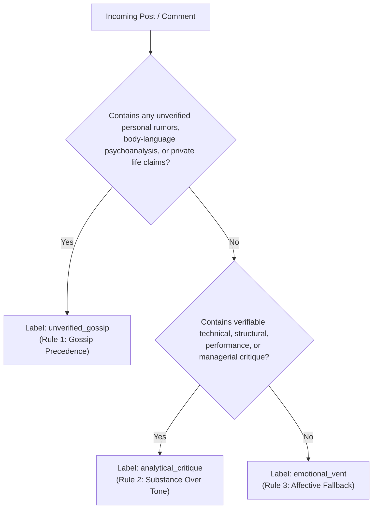

# TakeMeter: Project Planning & Taxonomy Specification

**Author / Lead:** Principal AI Engineer  
**Project:** TakeMeter — Discourse Quality Classification Pipeline  
**Target Community:** `r/katseyesnark_` (Reddit)  
**Base Architecture:** DistilBERT (`distilbert-base-uncased`) vs. Zero-Shot Baseline (`meta-llama/llama-4-scout-17b-16e-instruct`)  

---

## 1. Community Choice & Reasoning

### 1.1 Sociotechnical Context of Online Snark Communities
Online fandoms for contemporary pop culture—especially K-pop—have evolved into high-velocity participatory ecosystems characterized by intense emotional investment, algorithmic amplification, and intense parasocial bonding. Within this landscape, "snark" subreddits represent an adversarial offshoot: spaces dedicated to counter-narratives, skepticism, critical deconstruction, and unvarnished reaction to media products and public figures.

The subreddit `r/katseyesnark_` was established to discuss **KATSEYE**, the multinational girl group formed through the HYBE x Geffen survival reality program *The Debut: Dream Academy* (2023) and managed under the HYBE UMG joint venture. KATSEYE occupies a distinct industry position as a "global girl group" based in Los Angeles, combining Western pop promotional cycles with South Korean idol-training methodology. This structural intersection produces an unusually combustible discourse environment.

### 1.2 Discourse Quality Dynamics in `r/katseyesnark_`
Discourse in `r/katseyesnark_` does not exist on a single linear spectrum from "positive" to "toxic." Instead, it is partitioned across three fundamentally divergent communicative intents:

1. **Substantive Artistic and Commercial Criticism:** Discussions regarding live vocal performance (e.g., backing track ratios on US morning shows like *Good Morning America* or *Kelly Clarkson*), choreography synchronization, song structure, audio engineering, and corporate strategy by HYBE/Geffen.
2. **Unverified Rumor and Parasocial Speculation:** Baseless theories regarding internal member dynamics, training room animosity, dating lives, contract disputes, psychological motives, and unverified explanations for member hiatuses or line distributions.
3. **Affective and Cathartic Hostility:** Emotional vents, hyperbole, schadenfreude, and raw frustration driven by fandom fatigue, anti-fan behavior, or interpersonal conflict with the primary KATSEYE fandom ("Eyekons").

In this community, high-signal technical critiques are frequently obscured by waves of subjective vitriol and unsubstantiated personal rumors. Conversely, legitimate consumer critiques regarding sound engineering or live performance integrity are often dismissed by external observers as pure harassment due to the surrounding snark context.

### 1.3 Engineering Rationale for Automated Classification
Manual moderation of high-velocity snark forums suffers from severe human cognitive fatigue, inconsistent rule enforcement, and subjective bias. Developing an automated, fine-tuned natural language processing (NLP) classification pipeline is necessary for three operational objectives:

* **Moderator Queue Triage:** Automatically flagging unverified personal rumors for immediate review or quarantine, while routing constructive critiques to community review channels.
* **Longitudinal Discourse Health Tracking:** Quantifying the temporal shifts in discourse composition across promotional milestones (e.g., comeback announcements, live festival appearances, press cycles) to study fandom lifecycle decay.
* **Selective Content Curation:** Enabling end-users to apply client-side filters that isolate substantive performance analyses while suppressing low-effort hostility and unsubstantiated gossip.

---

## 2. Label Taxonomy

The TakeMeter taxonomy models discourse quality through three mutually exclusive, collectively exhaustive labels. Every post or top-level comment within `r/katseyesnark_` maps to exactly one category:

$$\mathcal{C} = \{\texttt{analytical\_critique}, \texttt{unverified\_gossip}, \texttt{emotional\_vent}\}$$

### 2.1 Taxonomy Definition Matrix

| Label | Theoretical Definition | Linguistic & Behavioral Markers | Negative Indicators (Exclusions) |
| :--- | :--- | :--- | :--- |
| **`analytical_critique`** | Structured, verifiable feedback grounded in observable media, audio/visual evidence, performance mechanics, styling execution, or corporate management decisions. | • References specific timestamps, venues, or broadcasts.<br>• Technical terminology (e.g., vocal register, pitch deviation, backtrack decibels, sync, garment tailoring).<br>• Comparative industry analysis and verifiable promotional metrics. | • No psychoanalysis of internal motives.<br>• No unverified personal rumors.<br>• Claims cannot rely on second-hand anonymous claims. |
| **`unverified_gossip`** | Speculative assertions or narratives concerning members' private lives, internal interpersonal friction, off-camera drama, psychological mindsets, or medical/contractual status lacking primary verification. | • Phrases: *"I heard," "insider says," "look at her face at 0:12," "they definitely hate each other."*<br>• Micro-expression / body language psychoanalysis.<br>• Unconfirmed claims regarding dating, feuds, or training room disputes. | • Verifiable press releases, confirmed agency statements, or public broadcast events (these belong in critique if analyzed factually). |
| **`emotional_vent`** | Subjective affective outbursts, hyperbole, aesthetic distaste, or non-substantive hostility devoid of verifiable technical evidence or structural reasoning. | • Exaggerated punctuation (`???`, `!!!!`), ALL-CAPS text.<br>• Slang/pejoratives: *"flop," "cringe," "unstan," "trash fire," "I'm sick of them."*<br>• Aesthetic complaints lacking concrete mechanical explanation. | • Presence of specific technical arguments or documented evidence (such inclusion promotes the text to `analytical_critique` or `unverified_gossip`). |

---

### 2.2 Concrete Realistic Post Examples

#### Label 1: `analytical_critique`

* **Example 1.A (Audio Engineering & Live Staging):**
  > *"During their KCON performance of 'Touch', the live audio mix had the backing track pushed to roughly -6dB while the handheld microphones were heavily compressed with virtually no low-end EQ. When Daniela and Lara moved through the second-chorus formation change, their vocal projection fluctuated significantly because the choreo requires rapid diaphragmatic breathing that wasn't compensated for in the gain staging."*
  > 
  > **Diagnostic Annotation:** Classifies as `analytical_critique` due to explicit references to audio technicalities (gain staging, compression, EQ, backing track volume), physical choreography mechanics, and observable live broadcast events.

* **Example 1.B (Wardrobe Tailoring & Stage Execution):**
  > *"The costuming choices for the GMA outdoor stage were clearly not fitted for active choreography. Yoonchae's pleated skirt kept shifting off-center during the lateral slide in 'Debut', forcing her to break arm extension twice to adjust the waistband. Production should have utilized reinforced inner waist elastic or switched to skorts like the dancers had."*
  > 
  > **Diagnostic Annotation:** Classifies as `analytical_critique` because it highlights an observable mechanical defect (garment slippage, broken arm extension) and presents structured, actionable production alternatives.

#### Label 2: `unverified_gossip`

* **Example 2.A (Interpersonal Animosity & Body Language Speculation):**
  > *"Did anyone catch how Sophia completely walked past Manon at Incheon airport without even making eye contact? When Manon handed her the coffee cup, Sophia’s jaw clenched and she rolled her eyes before turning her back. It’s so obvious there’s major beef between them since the line distribution dropped, and management is forcing them to pretend they're besties on TikTok."*
  > 
  > **Diagnostic Annotation:** Classifies as `unverified_gossip` because it projects internal psychological animosity, interpersonal feuding, and covert management coercion onto unverified micro-gestures and body language interpretations.

* **Example 2.B (Hiatus Motives & Training Room Lore):**
  > *"An insider on X who worked on the Dream Academy crew told me that Megan didn't actually sprain her ankle during rehearsals; she was suspended for two weeks because she got caught breaking curfew with trainees from another label. Geffen cooked up the injury story to keep the sponsor contracts intact."*
  > 
  > **Diagnostic Annotation:** Classifies as `unverified_gossip` because it introduces second-hand anonymous claims ("insider on X") alleging corporate cover-ups and personal rule infractions without verifiable corroboration.

#### Label 3: `emotional_vent`

* **Example 3.A (Affective Fatigue & Unfiltered Frustration):**
  > *"I literally cannot take this group seriously anymore. Every single time they post on TikTok I get second-hand embarrassment so bad my stomach hurts. They are so ridiculously fake and overproduced, I genuinely can't stand seeing them on my feed. Unstanning immediately."*
  > 
  > **Diagnostic Annotation:** Classifies as `emotional_vent` because the expression is entirely affective ("second-hand embarrassment", "can't stand seeing them", "unstanning") and offers zero concrete technical or verifiable factual claims.

* **Example 3.B (Aesthetic Disgust & Fandom Aggression):**
  > *"This entire comeback is a complete and utter disaster. Easily the worst music video of the year, the styling is cheap trash, and anyone who thinks this sounds good needs their ears cleaned. Absolute flop behavior from everyone involved."*
  > 
  > **Diagnostic Annotation:** Classifies as `emotional_vent` due to generalized hyperbole ("complete and utter disaster", "cheap trash", "absolute flop behavior") lacking technical explanation of songwriting, visual direction, or production.

---

## 3. Hard Edge Cases & Boundary Decision Rules

The primary challenge in classifying snark forum text lies in **compound posts**—submissions that interweave observable performance data with personal psychological projections, or bury legitimate technical critique beneath vulgar affective language.

### 3.1 Primary Edge Case Conflict
Consider the following boundary sample:

> *"Daniela completely missed her cue in the second chorus and was dragging her feet the entire live stage because she was out partying until 4 AM with LA influencers and clearly doesn't care about the group anymore."*

This submission exhibits:
1. **Observable Performance Fact:** Missed cue in the second chorus, delayed footwork.
2. **Unverified Lifestyle Speculation:** Partying until 4 AM with influencers.
3. **Psychological Projection:** "Clearly doesn't care about the group anymore."

If evaluated solely on the opening clause, the text could be misclassified as `analytical_critique`. If evaluated on tone alone, it might seem an `emotional_vent`.

### 3.2 Formal Decision Hierarchy: The Primary Intent Rule

To eliminate ambiguity, annotators and models must apply a deterministic precedence hierarchy:



#### Rule 1: Gossip Precedence (Gossip Overrides Critique and Vent)
* **Principle:** Any post that attributes an observable performance failure, hiatus, or career milestone to unsubstantiated private conduct, interpersonal feuds, or psychological motives **must** be classified as `unverified_gossip`.
* **Rationale:** Introducing unverified personal accusations corrupts the evidentiary standard of analytical discourse. For moderation purposes, rumor containment is higher priority than acknowledging incidental performance observations.

#### Rule 2: Substance Over Tone (Critique Overrides Vent)
* **Principle:** If a post uses aggressive, sarcastic, or frustrated vernacular, but articulates specific, verifiable structural, sonic, or visual observations (e.g., *"The mixing is absolute garbage, they dialed the high-shelf EQ up 6dB and Sophia's sibilance is piercing on every 's' sound"*), it **must** be classified as `analytical_critique`.
* **Rationale:** Tone policing degrades the utility of technical feedback. Strong emotional valence does not nullify empirical technical substance.

#### Rule 3: Affective Fallback (Vent as the Default Residue)
* **Principle:** Any post that expresses intense hostility, disappointment, or praise without establishing empirical grounding or verifiable references falls into `emotional_vent`.
* **Rationale:** Ensures that visceral, low-information reactions are quarantined from actionable discourse metrics.

---

## 4. Data Collection & Label Distribution Plan

### 4.1 Ingestion Pipeline & Endpoints
Data collection targets 200+ unique user contributions directly from `r/katseyesnark_`. Given recent Reddit API rate limitations and archival shifts, data ingestion combines three pathways:

1. **Official Reddit JSON Endpoints:** Crawling `/r/katseyesnark_/.json?limit=100` and `.../comments/.json?limit=100` with descriptive `User-Agent` headers.
2. **Arctic Shift Public Search API:** Querying historical posts and comments via `https://arctic-shift.photon-reddit.com/api/posts/search` and `.../comments/search`.
3. **PullPush Archive API Fallback:** Querying `https://api.pullpush.io/reddit/search/` to ensure full capture of historical comment threads.

### 4.2 Data Cleansing and Hygiene Protocols
To ensure high training signal, all scraped records undergo automated filtering:
* **Removal of Trivial / Null Artifacts:** Filtering out strings containing `[removed]`, `[deleted]`, or automated bot sticky comments (e.g., AutoModerator rules).
* **Length Constraints:** Post text must contain $>25$ characters; comment text must contain $>30$ characters to prevent single-word low-information noise (*"lol"*, *"agreed"*, *"flop"*).
* **Title-Body Concatenation:** For submissions with both a title and selftext, the fields are normalized as:
  $$\text{Text} = \text{Clean}(\text{Title}) \oplus \text{" "} \oplus \text{Clean}(\text{Selftext})$$
* **Deduplication:** Hashing cleaned string representations to eliminate crossposts, reposts, and quote-spam.

### 4.3 Target Distribution and Split Strategy
* **Target Dataset Size:** 203 unique annotated samples.
* **Partitioning:** Stratified random split preserving class balance:
  * **Train Set:** $70\%$ ($N = 142$ samples)
  * **Validation Set:** $15\%$ ($N = 30$ samples)
  * **Test Set:** $15\%$ ($N = 31$ samples)

```
Total: 203 Samples
├── Train (70%): 142 samples (~50 Critique, ~47 Gossip, ~45 Vent)
├── Validation (15%): 30 samples (10 Critique, 10 Gossip, 10 Vent)
└── Test (15%): 31 samples (11 Critique, 10 Gossip, 10 Vent)
```

### 4.4 Class Imbalance Mitigation
Natural distribution in snark subreddits typically skews heavily toward `emotional_vent` and `unverified_gossip`. To prevent model degeneration into trivial majority-class prediction:
1. **Stratified Annotation:** Active over-sampling of technical review threads and live stage discussions during manual annotation.
2. **Algorithmic Weighting:** Incorporating inverse-class-frequency loss weighting during DistilBERT fine-tuning:

$$w_c = \frac{N}{K \cdot N_c}$$

Where $N$ is total training instances, $K = 3$ is the number of classes, and $N_c$ is the frequency of class $c$. The custom weighted cross-entropy loss function is defined as:

$$\mathcal{L}_{\text{weighted}} = - \frac{1}{B} \sum_{i=1}^B w_{y_i} \log \frac{\exp(z_{i, y_i})}{\sum_{j=1}^K \exp(z_{i, j})}$$

---

## 5. Evaluation Metrics Reasoning

### 5.1 Comprehensive Multi-Metric Framework
Evaluating discourse quality classification requires looking beyond overall accuracy. Given the operational stakes of automated moderation, different misclassifications carry asymmetric real-world penalties:

1. **Overall Accuracy:**
   $$\text{Accuracy} = \frac{\sum_{c=1}^K \text{TP}_c}{N_{\text{total}}}$$
   Provides a baseline summary of global pipeline correctness, but can mask systematic failure on smaller or harder classes.

2. **Per-Class Precision:**
   $$\text{Precision}_c = \frac{\text{TP}_c}{\text{TP}_c + \text{FP}_c}$$
   * **Operational Importance for `analytical_critique`:** High precision is non-negotiable. If false positives occur (e.g., toxic vents labeled as critique), users lose trust in the "constructive criticism" feed.

3. **Per-Class Recall:**
   $$\text{Recall}_c = \frac{\text{TP}_c}{\text{TP}_c + \text{FN}_c}$$
   * **Operational Importance for `unverified_gossip`:** High recall is critical. False negatives allow dangerous rumors or defamatory claims to slip past moderation filters undetected.

4. **Macro-Averaged F1-Score:**
   $$\text{Macro F1} = \frac{1}{K} \sum_{c=1}^K \text{F1}_c, \quad \text{where } \text{F1}_c = 2 \cdot \frac{\text{Precision}_c \cdot \text{Recall}_c}{\text{Precision}_c + \text{Recall}_c}$$
   Selected as the primary optimization and stopping metric. Macro F1 weights every class equally regardless of sample frequency, preventing the model from exploiting class imbalance.

5. **Confusion Matrix Diagnostics:**
   Mapping predicted labels versus true ground truth reveals qualitative error modes—specifically distinguishing whether errors stem from boundary noise (e.g., critique vs vent with harsh language) or fatal structural confusion (e.g., gossip mislabeled as critique).

---

## 6. Success Thresholds

To validate that task-specific fine-tuning on DistilBERT provides superior utility over zero-shot frontier language models, the pipeline must surpass the following pre-registered empirical gates on the held-out test set ($N=31$):

| Metric | Minimum Acceptable Threshold | Target Benchmark | Zero-Shot Baseline Target |
| :--- | :--- | :--- | :--- |
| **Overall Test Accuracy** | $> 75.0\%$ | $\ge 80.0\%$ | $\approx 60.0\% - 65.0\%$ |
| **Macro-Averaged F1** | $> 0.72$ | $\ge 0.80$ | $\approx 0.60 - 0.65$ |
| **`analytical_critique` F1** | $> 0.70$ | $\ge 0.80$ | $\approx 0.60 - 0.65$ |
| **`unverified_gossip` F1** | $> 0.70$ | $\ge 0.78$ | $\approx 0.58 - 0.64$ |
| **`emotional_vent` F1** | $> 0.70$ | $\ge 0.80$ | $\approx 0.62 - 0.68$ |
| **Baseline Performance Beat** | $+10.0\%$ absolute lead | $\ge +15.0\%$ absolute lead | Benchmark reference |

### Justification of Gates
A threshold of $>75\%$ accuracy with $>0.70$ per-class F1 guarantees that the model produces reliable classifications across all three categories. A $+10\%$ improvement over the zero-shot baseline justifies the compute, labeling, and engineering overhead of deploying a dedicated fine-tuned Transformer model.

---

## 7. AI Tool Plan & Engineering Methodology

### 7.1 Label Taxonomy Stress-Testing
Prior to labeling the dataset, frontier LLMs (e.g., Gemini 1.5 Pro, Llama-3-70B) are tasked with generating adversarial synthetic submissions that stress-test boundary definitions:
* **Adversarial Generation Directive:** Generate compound posts combining high-register technical musicology with subtle malicious personal rumors, or sarcastic vulgarity with legitimate staging critique.
* **Taxonomy Validation:** If human evaluators cannot achieve unanimous agreement on a synthetic example, the decision rules in Section 3 are refined before human dataset annotation begins.

### 7.2 Human-in-the-Loop Annotation Protocol
To maximize data quality and avoid circular reasoning:
1. **Pre-Annotation Pass:** An automated script passes unannotated Reddit posts to an LLM assistant using the zero-shot classification prompt, producing candidate labels and chain-of-thought justifications.
2. **Human Expert Verification:** A human annotator reviews every candidate label against the formal decision hierarchy (Section 3). The human annotator makes the final binding label decision, overriding the model whenever compound posts trigger Rule 1 or Rule 2.
3. **Agreement Tracking:** A sample of 50 items is dual-annotated to measure Inter-Annotator Agreement using Cohen’s Kappa ($\kappa \ge 0.82$ targeted).

### 7.3 Automated Failure Analysis & Diagnostics
Post-training evaluation incorporates automated scripts to inspect model weaknesses:
* **Loss-Ranked Error Extraction:** Programmatically extracting the top 10% highest-loss test predictions to isolate systematic misclassifications.
* **Lexical Over-Indexing Check:** Testing the model on counterfactual perturbed samples (e.g., stripping profanity from a vent to check if it mistakenly shifts to critique; swapping member names into a technical post to check if it mistakenly triggers gossip).
* **Confidence Calibration Analysis:** Computing expected calibration error (ECE) to verify that softmax confidence matches true empirical accuracy.